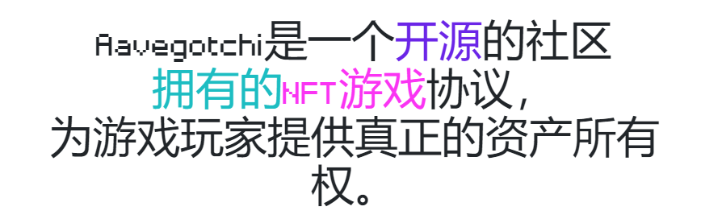
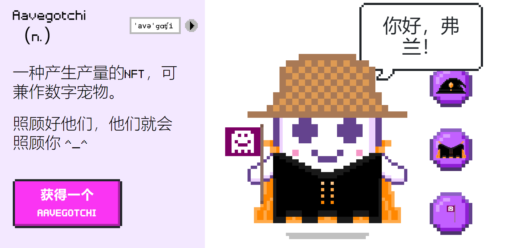
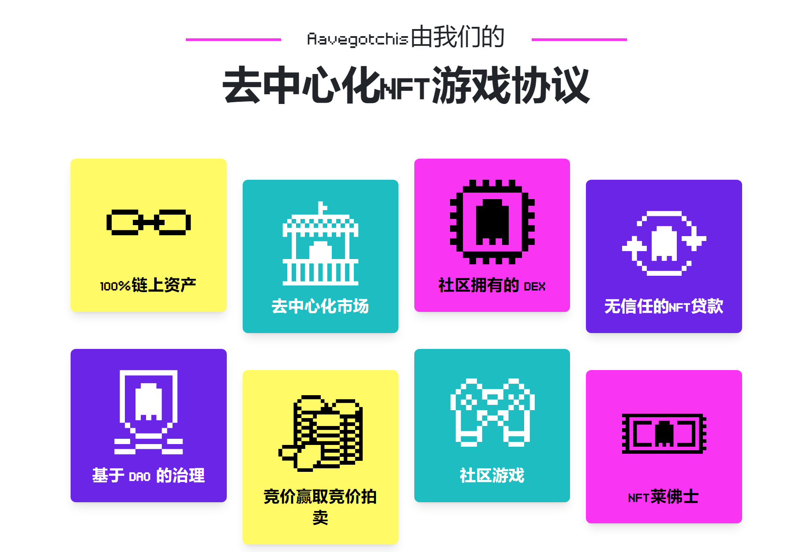
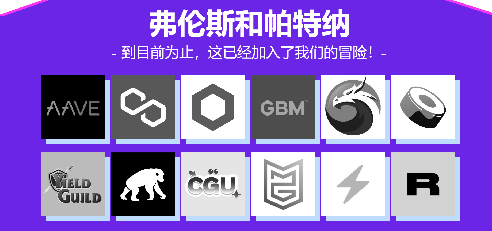

**Aavegotchis**是生活在以太坊区块链上的罕见加密收藏品，以Cryptokitties、Axie Infinity和Cryptovoxels等流行区块链游戏中使用的ERC721标准。

有传言说Aavegotchis实际上是清算产量农民的幽灵，他们决心回来为他们的家族带来荣誉。

**Aavegotchi**在区块链游戏领域引入了许多创新，包括DeFi令牌抵押品赌注、动态稀有性、稀有性农业、DAO控制的游戏机制，以及具有智能合同互操作性和世界市政厅风格投票的开放元宇宙

就像最初的Tamagotchi向世界介绍了数字宠物一样，Aavegotchi向世界介绍了以数字价值为后盾的可玩NFT。

