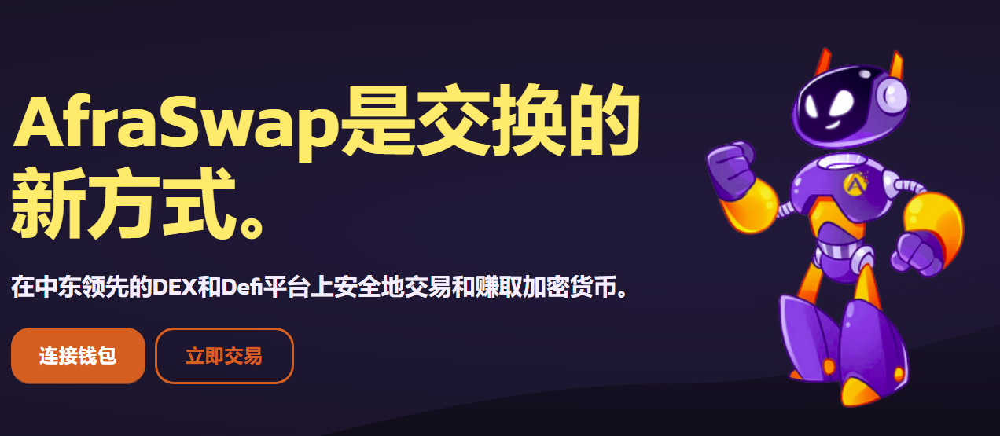
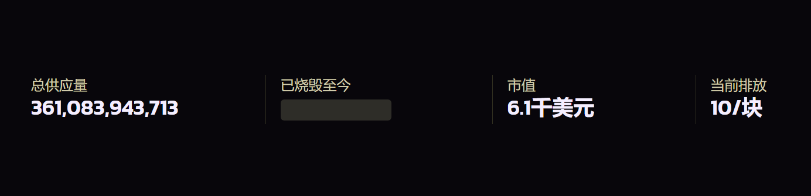

---
title: "AFRASWAP"
description: "AfraSwap is the new way to Swap. Trade and earn cryptocurrencies securely on the leading DEX and Defi Platform in the Middle East."
date: 2022-08-02T00:00:00+08:00
lastmod: 2022-08-02T00:00:00+08:00
draft: false
authors: ["xixi0727"]
featuredImage: "afraswap.png"
tags: ["DeFi","AFRASWAP"]
categories: ["nfts"]
nfts: ["DeFi"]
blockchain: "BSC"
website: ""https://afraswap.io/
twitter: "https://twitter.com/afraswap"
discord: ""
telegram: ""
github: "https://github.com/afraswap/"
youtube: ""
twitch: ""
facebook: ""
instagram: ""
reddit: ""
medium: ""
steam: ""
gitbook: ""
googleplay: ""
appstore: ""
status: "Live"
weight: 
lightgallery: true
toc: true
pinned: false
recommend: false
recommend1: false
---
Afraswap和Aryacoin团队很高兴地宣布，Afraswap在主网上的完整发布于2021年12月15日成功完成。此次发布标志着Afraswap项目旨在为分散式金融世界带来的创新的开始，分散式金融通过利用现有和新用户提供的功能来教育并允许现有和新用户在财务上更加独立

区块链技术，并以最大的安全性和安全性迅速走向分散化。Afraswap的主要目标是让用户如何安全地浏览分散的世界，因此，我们所有的应用程序都专注于安全性和易用性。作为实现这一目标的第一步，Afraswap推出了标准AMM功能，这是前任报价的其余部分，但除此之外，任何交换

Afraswap的界面通过聚合路由器而不是标准的Dex路由器，这允许用户始终安全地获得交易的最佳价格，而无需在不同的掉期中搜索最佳价格。该团队为提高用户的透明度和安全性而采取的另一个措施是从合同中删除有争议的Migrator代码。恶意行为者经常使用该代码，他们通常是项目的创建者和人，以窃取用户下注的资金。这被称为Rugg Pull，最近经常发生大型项目，导致用户损失数百万美元的资金，但该代码仍然用于PancakeSwap等项目。

该团队删除的另一个代码是FeeTo代码，该代码几乎可以在所有基于AMM的代码中找到

目前存在分散式交易所。从Sushiswap到Pancakeswap，每个Dex在合同中都使用此代码，使他们能够承担用户支付的部分费用，从而减少利润

流动性提供商。

