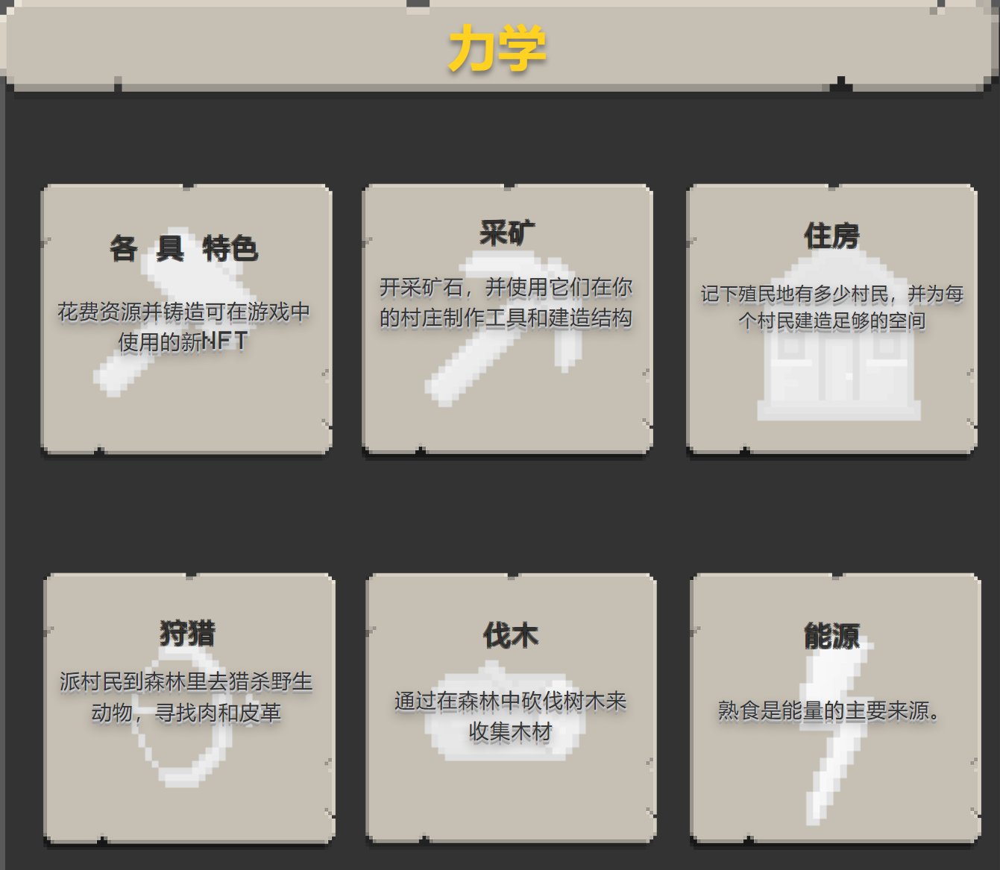
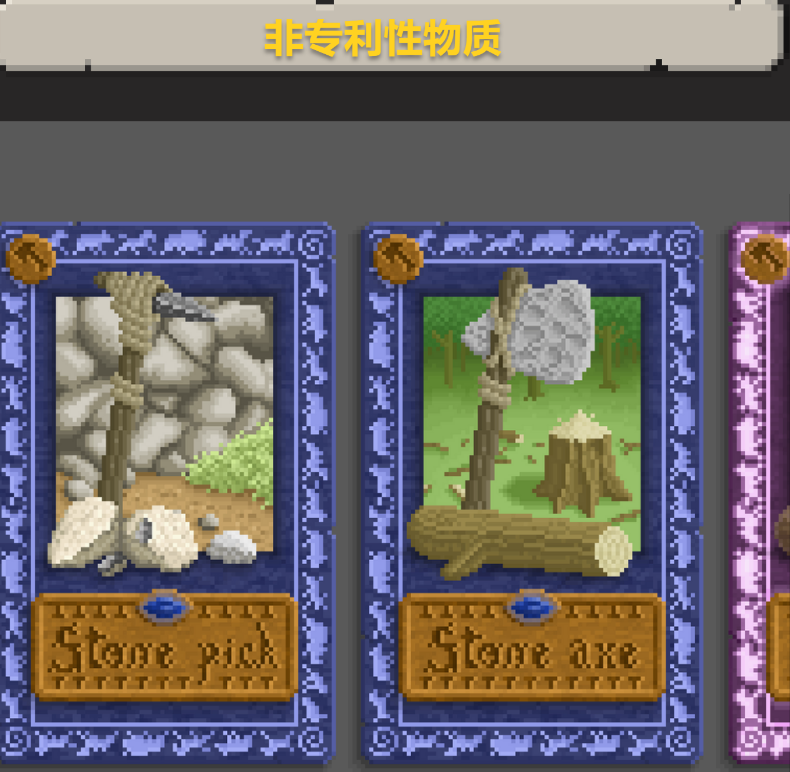
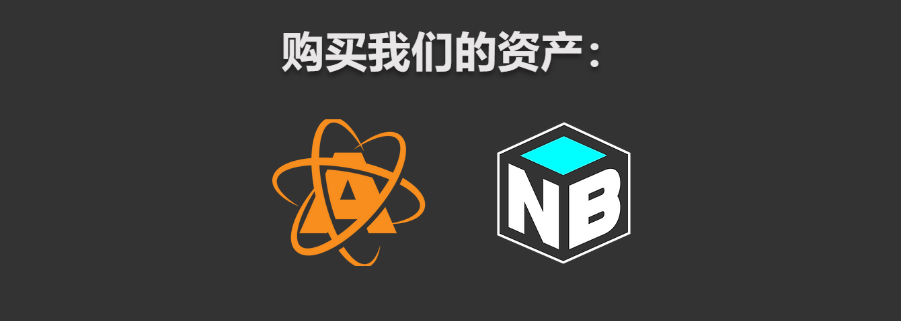

回到过去，直到你到达石器时代，然后狩猎、制作和生存，直到你到达青铜和你的殖民地的铁器时代。

它具有Play-to-Earn功能，允许用户通过玩游戏赚取NFT和代币。

您的主要重点是维护一个繁荣的殖民地，这意味着您需要首先满足殖民地的要求，同时不断发展您的技术。

玩家将能够通过更好的技术赚取更多的资源，这意味着在石器时代，他们将获得比青铜时代和铁器时代更少的资源。

**Age of Farming**是一款 具有NFT像素化图形的WAX区块链游戏。

回到过去，直到你到达石器时代，然后狩猎，制作和生存，直到你和你的殖民地一起到达青铜和铁器时代。
它具有Play-to-Earn功能，允许用户通过玩游戏来赚取NFT和代币。

你的主要重点是保持一个繁荣的殖民地，这意味着你需要首先满足你的殖民地的要求，同时不断发展 你的**技术**。

玩家将能够 通过**更好的技术**获得更多**资源，这意味着在**石器时代**，他们将比**青铜时代获得更少的资源。 

