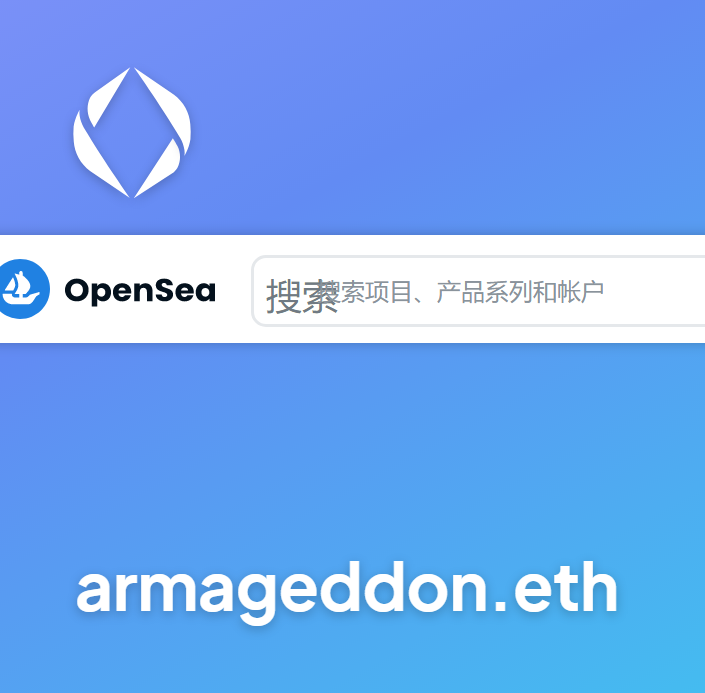
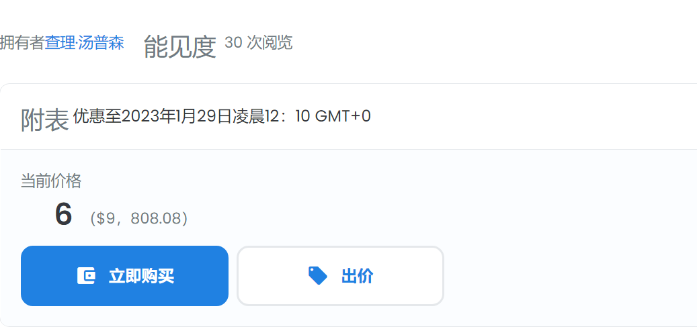
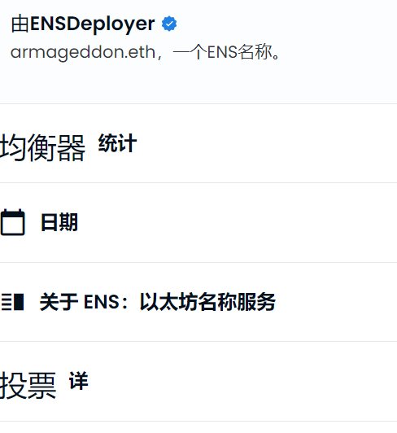

启动ARMAGEDDON项目

智能合同项目，经过验证并开放。

平均每天支付30%的投资金额（那些之前进入的人将获得更多，因为购买矿工会更便宜，并可能在第一次偿还押金

一天）

推荐计划：合作伙伴投资金额的15%

10.950% APR

对Binance Smart Chain（BEP-20）加密货币进行投资，有几种可用的加密货币可供存款：BB USDT BUSD ETH CAKE BTC SHIBA DOGE ADA。（我会在下一篇文章中发送所有池的链接）

使用Metamask或TrustWallet

游戏的目标是比其他玩家更早、更频繁地发射更多的加密流星。这反过来又可以让你更快地赚取更多的股息。这些加密流星不知疲倦地为您工作，平均每天为您提供密码流星价值的30%。

6:1策略仍在继续：6天我们再投资（更多流星-再投资），第7天我们提取利润（收集STARDUST-撤回）

