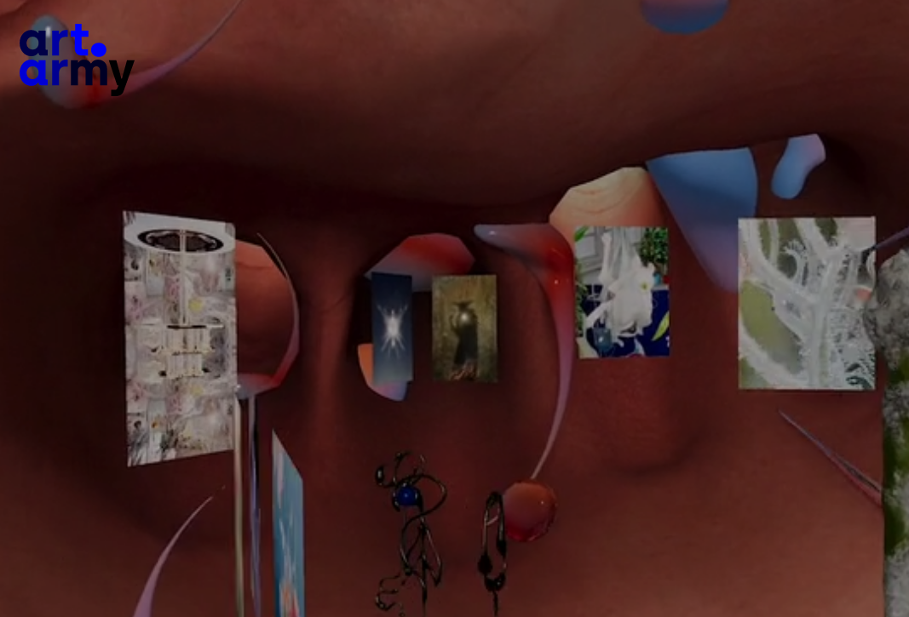
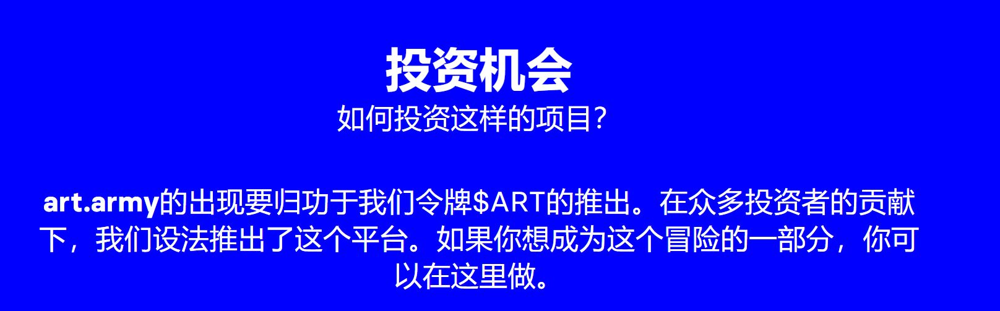
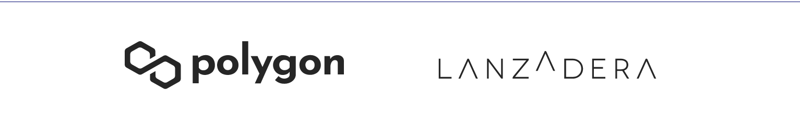

Art.army是一个项目，旨在围绕艺术的新技术可能性和新的数字经济整合艺术家、画廊所有者、投资者和爱好者。这是一个旨在通过整合交互式和多媒体提案来彻底改变购买体验的项目。

在该平台上，可以拍卖、交换、买卖和出售艺术投影的NFT，但它也将作为推广专注于选定艺术家的特定活动或新体验的框架，例如支持该项目的代币持有人的股份。

我们希望为数字作品提供一个平台，支持所有尚未与加密艺术相关的艺术家，并为他们提供推广其作品的独特机会。

我们希望通过倾听某些社区的需求来特别关注他们，我们将从推出第一个西班牙语市场开始，并启动平行的综合项目，允许音乐家或设计师推广他们的创作。

这是一个具有协作使命的项目，希望以严肃和包容的方式响应围绕网络上数字艺术创造的巨大需求。Art.army是艺术专家和策展人、老牌创作者和新人才的聚会点。

一个市场，艺术家和创作者将能够通过经过区块链技术认证的完全安全的铸造过程来创建他们的数字作品或NFT。艺术军将提供安全、信任以及高效和有效的环境，让所有参与者都感到自己是共同项目的一部分。

艺术的新未来

欢迎来到我们的数字艺术区块链平台。我们让技术更接近艺术家、策展人、收藏家和艺术机构。

art.army允许您交易数字艺术，并在我们的元宇宙中获得艺术空间。

**art.army**是第一个在虚拟空间中展示展览的平台，在每个展览提案中提供身临其境的体验。一个元宇宙，您可以在其中获得自己的数字空间来展示您的作品或展示您的收藏。我们的元宇宙由**999**个独特空间的限量版组成。

**Transcrypted**源于需要围绕艺术创作和NFT的未来创造一个辩论空间。

这是一个空间，转录了整个艺术界不同观点的广泛代表的观点。我们希望在概念和技术上不断发展，使NFT市场成为所有人的机会。一个严肃，公平和可持续的模式。

“艺术已经发展，它的格式也随之发展，但几十年来，销售它的方式一直都是一样的。“

特蕾莎·洛佩斯-多里加

