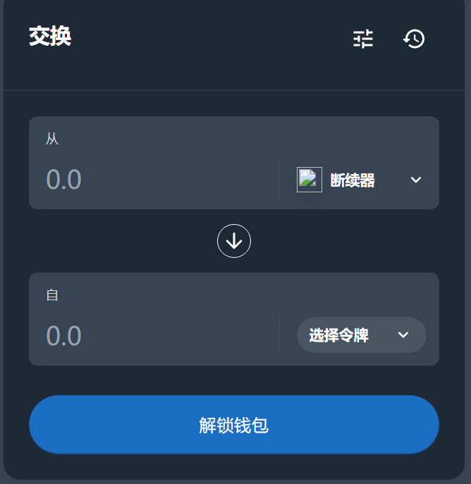
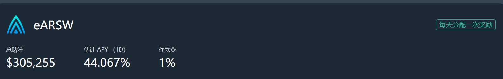

---
title: "ArthSwap"
description: "One-stop & No.1 DeFi on Polkadot💫 built on the Astar Network / Huge TVL / Simple UX"
date: 2022-08-05T00:00:00+08:00
lastmod: 2022-08-05T00:00:00+08:00
draft: false
authors: ["xixi1127"]
featuredImage: "arthswap.png"
tags: ["DeFi","ArthSwap"]
categories: ["nfts"]
nfts: ["DeFi"]
blockchain: "Astar"
website: "https://app.arthswap.org/#/swap"
twitter: "https://twitter.com/arthswap"
discord: "https://discord.com/invite/eeJdfmgW8g"
telegram: "https://t.me/ArthSwap_official"
github: "https://twitter.com/arthswap"
youtube: ""
twitch: ""
facebook: ""
instagram: ""
reddit: ""
medium: ""
steam: ""
gitbook: ""
googleplay: ""
appstore: ""
status: "Live"
weight: 
lightgallery: true
toc: true
pinned: false
recommend: false
recommend1: false
---
ArthSwap是一个一站式Defi On Astar网络。

我们的使命是为Astar Network生态系统的扩展做出贡献。

具有简单的Ul和设计高APY，它可以在Astar网络上实现高频交易。

我们专注于Astar网络生态系统的增长，并愿意优化Astar的所有元素，因此我们认为自己是一个“Astar原生”的dApp。

