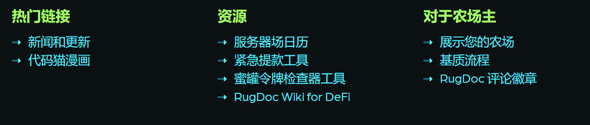
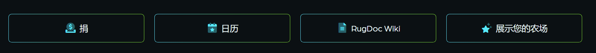

名称：Artic令牌符号：ARTIC链：Binance智能链令牌合同：

0x1999B0613689D987360aBeF5c50A576e4B4e55B6农业将在11853650 lnitial块启用

流动性：ARTIC-BUSD和ARTIC-BNB农场初始流动性燃烧的时锁-12小时无收获锁我们的团队了解当你找到一个好的农场时，你感受到的胜利和地毯拉的沮丧。这个农场收集了我们团队对我们认为成功的老学校农场模式要素的看法。

为此，我们决定对我们的平台进行低排放率（0.05）。

我们相信，这种模式将帮助最终用户在很长一段时间内获得最大收益率。

- ⚠️ [Dev将50%的代币分发到6个不同的地址](https://bscscan.com/address/0xb0bd409d45be86744daf2b6e88aee0297a222e58#tokentxns)，这些地址同时存放在主厨中，并且可以随时删除和出售。另外50%被添加为流动性并燃烧。
- ~~⚠️ 主厨目前不在[时间锁](https://wiki.rugdoc.io/docs/timelocks-explained/)后面~~
- ✅ 最高4%的存款费用
- ✅ 正确核算*任何*代币池的转账税
- 额外10%的排放奖励将铸造到开发地址

⚠️ [**三重检查**](https://wiki.rugdoc.io/docs/how-to-check-your-contract-interactions/)您与之交互的合同是否与此处审查的合同相匹配（[0xB9505C47...D1C5](https://bscscan.com/address/0xB9505C47015f663759403CAded9ffa820F3cD1C5#readContract))

