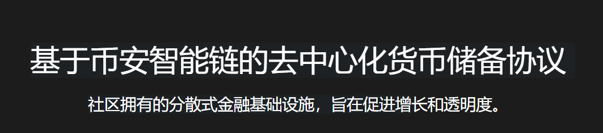
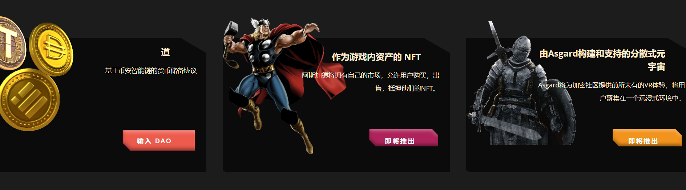
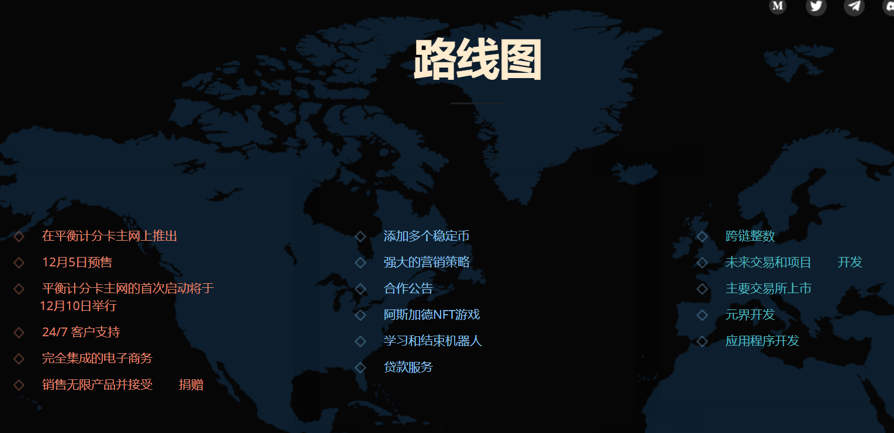

AsgardToken.com将基于NFT和艺术的画廊和市场，专门从事北欧文化和神话。

Asgard令牌将作为我们生态系统中NFT的支付货币，给令牌带来购买压力。

这是加密世界一个特定且很少被探索的利基市场，但具有巨大的潜力，因为世界上北欧文化的粉丝数量巨大。

*（除了广受好评的游戏外，请参阅《维京人》、《洛基》等热门系列，以及广受好评的游戏：

《战神》）。

通过这种方式，阿斯加德生态系统是先驱。

